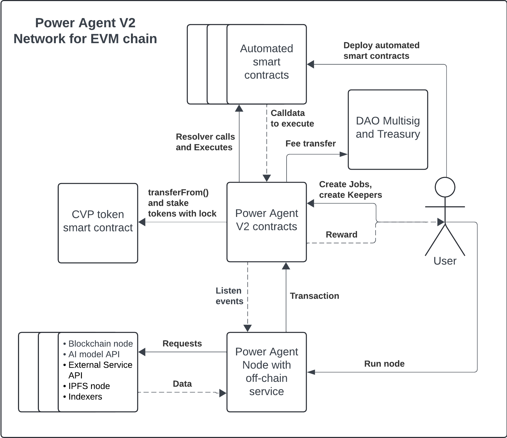

# PIP-2: Safety module for Power Agent network security

## Abstract
A Safety Module smart contract that holds a large amount of CVP tokens from protocol users with an economic incentive for staking. In case of a large network failure, PowerPool DAO may use these CVP tokens to cover losses.

## Motivation
Power Agent V2 network is a multichain network for automated and guaranteed transaction execution.

On each supported EVM network, it consists of:
- Power Agent V2 contracts, which contain data about Keepers, Jobs, Keeper selection Execution, Slashing and Reward logic;
- Power Agent V2 node, which is off-chain software that gets data about the current Power Agent V2 contract state from Subgraph or Subquery indexers, listens for contracts events, calls Power Agent off-chain service or automated smart contracts to get calldata, and sends transactions to execute automated smart contracts.
- Power Agent V2 Off-chain service is software running together with the Power Agent V2 node. It receives requests from the Power Agent V2 node with the script IPFS hash and additional parameters, downloads the script from IPFS, and executes it to generate execution calldata. The script can make API calls to a blockchain node, AI model API, and external service API.
- DAO Multisig and Treasury is a Gnosis Safe smart contract that has admin rights over other Power Agent V2 contracts and accumulates part of the protocol fees from Job owners' deposits.

Each chain has an isolated set of Power Agent V2 contracts. The main CVP token is deployed on Ethereum and will be bridged via the deBridge protocol to every supported chain. Currently, Power Agent contracts use tCVP tokens for staking, but as the Power Agent network's reliability increases, they will be migrated to CVP.

One of the key features of the network is a guarantee of execution due to an automated slashing mechanism. The Power Agent smart contract assigns Keepers randomly for each Job for each execution by using `block.prevrandao` or the native Power Agent VRF. If a Keeper fails to execute a Job, other Keepers have a time slot to execute the Job instead of the assigned Keeper, slash it, and get the reward.

Although there may be situations where the non-execution of a particular job is more profitable than execution, even with slashing, such as in the case of liquidation protection in a lending protocol. In that case, we need a mechanism to guarantee that the protocol will have enough funds to cover major losses.

First, we propose to accumulate part of the fees from Job owners' deposits into the Treasury on Ethereum. Second, we propose to develop a Safety Module smart contract on Ethereum, where users will be able to stake CVP with a lock period ranging from 3 weeks to 6 months. Users will receive a portion of protocol fees from all chains and CVP token emissions from the PowerPool Ethereum Treasury. In case of a large protocol failure, the PowerPool DAO may decide to use these CVP tokens, along with native tokens such as ETH, to cover losses.

## Design
In general, the PowerAgent Safety Module is a smart contract deployed on Ethereum. Users may stake CVP tokens for a period ranging from 3 weeks to 6 months. The Safety Module contains logic for staking, automated transfer of CVP tokens from the Reservoir contract, their proportional distribution, and protocol fees distribution. Safety Module functions will be Jobs in the Power Agent contract, ensuring the network automatically supports its functionality.

### EVM chain
On every EVM chain, there is an AgentManager contract with admin rights that automatically withdraws fees to maintain system Job balances, such as VRF. Additionally, AgentManager will transfer a defined percentage of withdrawn fees to the Safety Module contract on Ethereum via a bridge.

The Power Agent node calls the resolver function in AgentManager, receives a true response and calldata, and sends a transaction to the Power Agent contract. The Power Agent contract then calls AgentManager, which withdraws fees, uses part of the fees to deposit into Job balances, and sends the remaining part through the bridge to the DAO Multisig and Safety Module.

### Ethereum
On Ethereum, the AgentManager contract also maintains Job balances, just as it does on other EVM chains. The Power Agent node calls the resolver function in the Safety Module, receives a true response and calldata, and sends a transaction to the Power Agent contract. The Power Agent contract then calls the Safety Module, which transfers CVP from the Reservoir and completes the transfer of fees from the bridge to the DAO Multisig and the Safety Module itself, if necessary.

### Implementation details
Here are some current ideas regarding implementation:
- Safety Module Contract:
  - Use a modified version of [BaseRewardPool.sol](https://github.com/convex-eth/platform/blob/main/contracts/contracts/BaseRewardPool.sol) from Synthetix with the following modifications:
    - Support multiple reward tokens: ETH and CVP.
    - For each user deposit, increase the user's balance proportionally to the lock period.
    - For each user deposit, record a structure with the deposit amount, minted balance, and lockup end.
    - For each user deposit, calculate `userBalance` as `(_amount * _duration * 10000) / withdrawalRateBPS`.
    - Distribute rewards no longer than the last lock period.
    - Grant the Owner rights to withdraw CVP and change the withdrawal rate.
    - Track `lockedBalance`;
    - Use `withdrawalRateBPS`, initially set to 10000. On each withdrawal by the Owner, recalculate `withdrawalRateBPS` as `withdrawalRateBPS*((lockedBalance - amount)/lockedBalance)`.
    - On each user withdrawal, calculate `tokensToTransfer` as `(userBalance * withdrawalRateBPS) / (lockDuration * 10000)`.
    - Add a function to withdraw fees from the bridge and distribute them.
    - Add a function to withdraw CVP from the Reservoir.
    - Add a resolver function.
- Job Management:
  - Use a Job to withdraw and distribute fees as well as to withdraw CVP from the Reservoir.
- AgentManager Role:
  - Use AgentManager to maintain the Safety Module Job.

